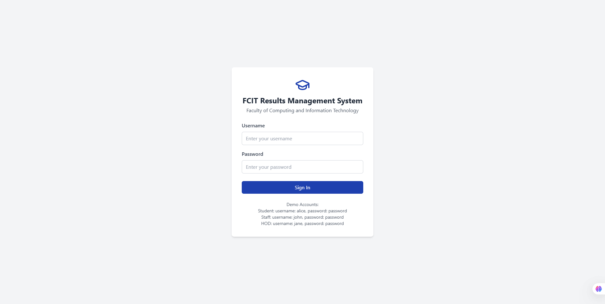
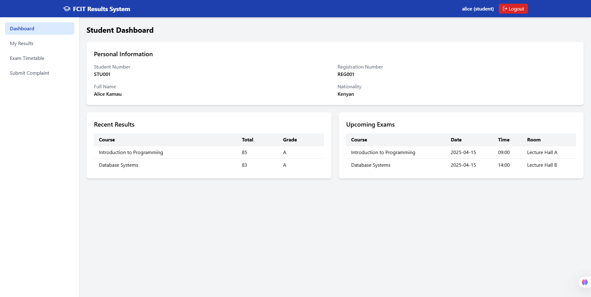
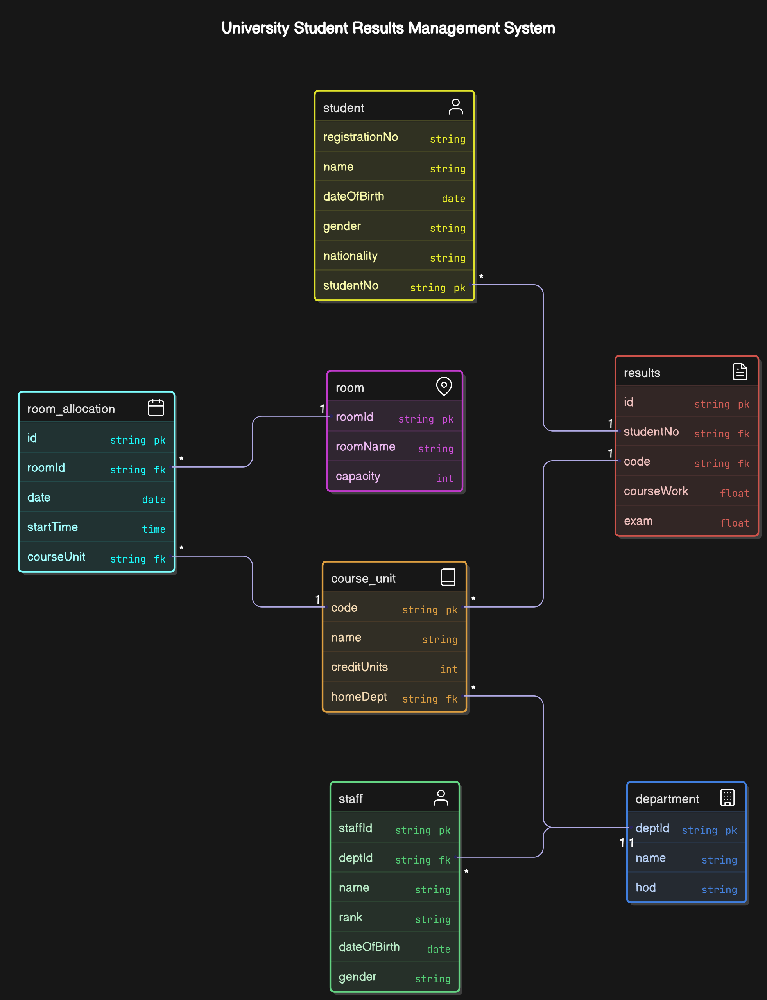

# SchoolManagement-frontend-mockup

# Student Results Management System (SRMS)

This project is a ReactJS-based web application designed to manage student results, course timetables, seat allocations, and complaints in a university setting. The system is tailored to meet the needs of students, faculty staff, and heads of departments, addressing key challenges in the current manual system. The backend of the application is database-driven and stores all necessary data for managing student results and course-related activities.




## Table of Contents
1. [Overview](#overview)
2. [Technologies Used](#technologies-used)
3. [Database Schema](#database-schema)
4. [Features](#features)
5. [Stakeholder Requirements](#stakeholder-requirements)
6. [Installation](#installation)
7. [Usage](#usage)
8. [Contributors](#contributors)

## Overview

This application allows students to view their test/exam results and timetables, submit complaints regarding their results, and automatically assigns seats for exams to prevent cheating. Lecturers and staff can view and edit results, while the head of departments can view and manage departmental timetables and room allocations.


The system supports multiple user roles:
- **Student**
- **Lecturer (Staff)**
- **Head of Department**
- **Examination Office Staff**

The main features of the system include:
- **Student Results**: Students can view their results online.
- **Timetables**: Students, staff, and heads of departments can access exam and course timetables.
- **Room Allocations**: The system automatically assigns rooms for exams to prevent cheating.
- **Complaints**: Students can submit complaints related to their results directly to the concerned lecturer.

## Technologies Used

- **Frontend**: ReactJS (with Context API for state management)
- **Backend**: Node.js, Express.js
- **Database**: MySQL or PostgreSQL
- **Other Libraries**: Axios (for API requests), React Router (for navigation)

## Database Schema

The following tables are used to structure the data for this application:



- **Department**:
  - `DeptId` (Primary Key)
  - `name`
  - `hod` (Head of Department, foreign key)

- **Staff**:
  - `staffId` (Primary Key)
  - `name`
  - `rank`
  - `dateOfBirth`
  - `gender`
  - `deptId` (Foreign Key to Department)

- **Student**:
  - `studentNo` (Primary Key)
  - `registrationNo`
  - `name`
  - `dateOfBirth`
  - `gender`
  - `nationality`

- **CourseUnit**:
  - `code` (Primary Key)
  - `name`
  - `creditUnits`
  - `homeDept` (Foreign Key to Department)

- **Results**:
  - `studentNo` (Foreign Key to Student)
  - `code` (Foreign Key to CourseUnit)
  - `courseWork`
  - `exam`

- **Room**:
  - `roomId` (Primary Key)
  - `roomName`
  - `capacity`

- **RoomAllocation**:
  - `roomId` (Foreign Key to Room)
  - `courseUnit` (Foreign Key to CourseUnit)
  - `date`
  - `startTime`

## Features

- **Student Features**:
  - View results for course work and exams.
  - View test/exam timetable.
  - Submit complaints to the lecturer regarding test/exam results.

- **Lecturer (Staff) Features**:
  - View all results for the courses they teach.
  - Edit results of the papers they teach.
  - View test/exam timetables for the faculty.

- **Head of Department Features**:
  - View the timetable for all course units in their department.
  - View the room allocation and student schedules for courses in the department.

- **Examination Office Features**:
  - Automatically assign seats to all students based on registered courses for each exam.

## Stakeholder Requirements

### A) **Student**:
- **View Results**: A student can check their results, both coursework and exams.
- **View Timetable**: Students can view their test/exam timetable for upcoming sessions.
- **Submit Complaints**: If a student feels there is an issue with their results, they can submit a complaint to the respective lecturer for review.

### B) **Head of Department**:
- **Department Timetables**: The head of the department should have access to all timetables for courses in their department.
- **View Room Allocations**: The head of department can see the room assignments for exams and ensure that courses are scheduled properly.

### C) **Staff**:
- **View Results**: Lecturers should be able to view the results for the papers they teach.
- **Edit Results**: Lecturers can make necessary updates to the results of their courses.
- **View Timetable**: Lecturers can check the exam/test timetable to know when they are teaching or supervising.

## Installation

### Prerequisites
- Node.js (version 14 or higher)
- MySQL or PostgreSQL Database Server

### Steps
1. **Clone the repository**:
    ```bash
    git clone https://github.com/incognitoDevOps/SchoolManagement-frontend-mockup.git
    cd SchoolManagement-frontend-mockup
    ```

2. **Install dependencies**:
    - Frontend (ReactJS):
      ```bash
      cd client
      npm install
      ```
    - Backend (Node.js):
      ```bash
      cd server
      npm install
      ```

3. **Configure the database**:
    - Set up your MySQL or PostgreSQL database and configure the connection in the backend's `.env` file.

4. **Run the application**:
    - Start the server (Backend):
      ```bash
      npm start
      ```
    - Start the frontend (ReactJS):
      ```bash
      npm start
      ```

5. Open your browser and navigate to `http://localhost:3000` to access the application.

## Usage

Once the application is set up and running:
- **Students** can log in, view results, view timetables, and submit complaints.
- **Lecturers** can log in, view/edit results, and view timetables.
- **Heads of Departments** can log in and view all departmental timetables and room allocations.
- **Examination Office Staff** will have automatic seat assignments for exams.

